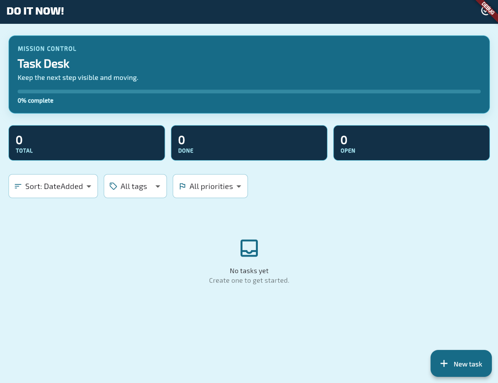
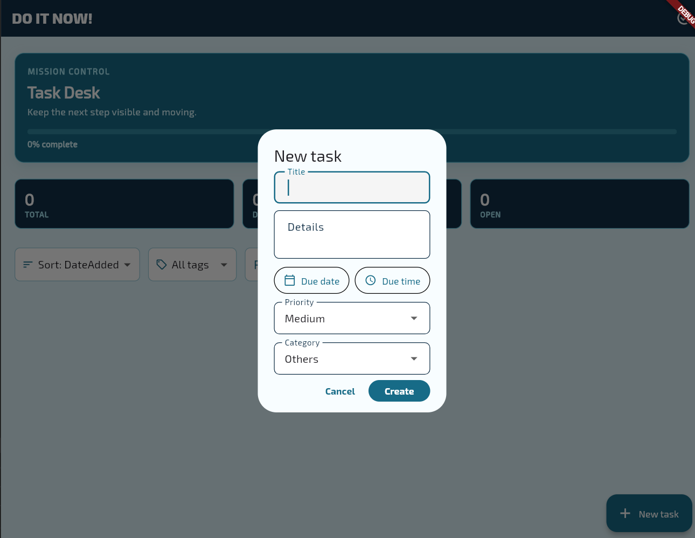
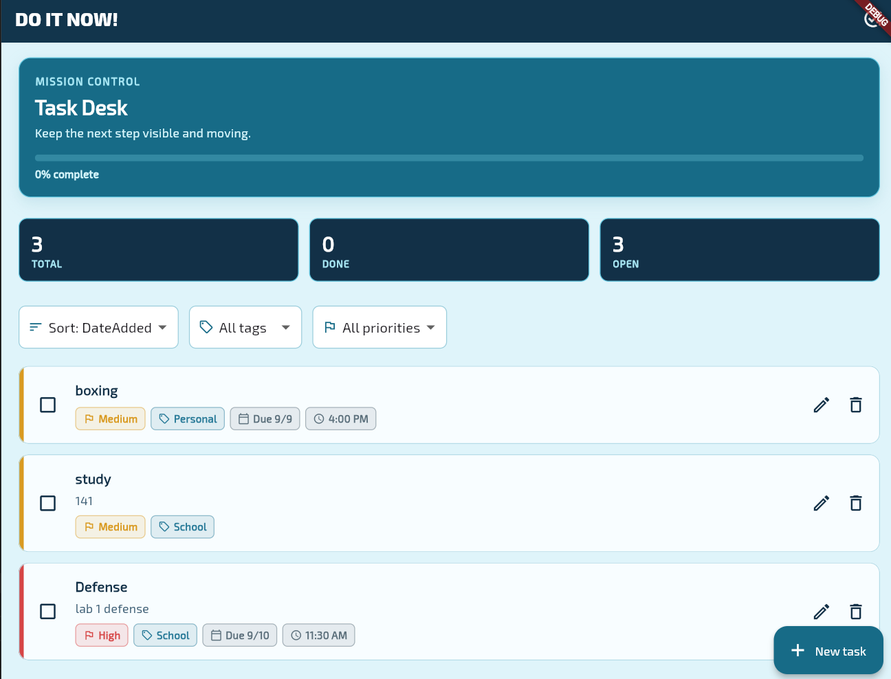
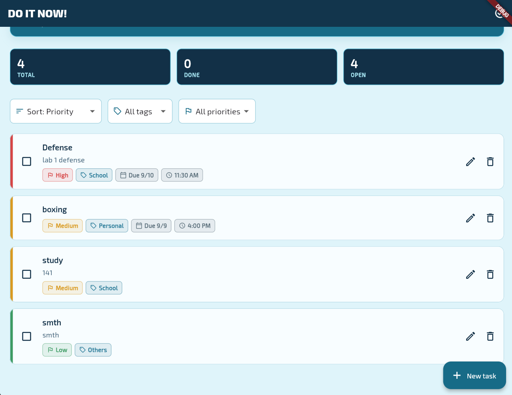

# Do It Now!

A Flutter task-management app with a game HUD-inspired interface. Tasks support due dates, due times, priorities, categories, completion state, sorting, filtering, undo deletion, and Firestore persistence.

## Tech Stack

- **Flutter and Dart**: cross-platform UI and application logic.
- **Firebase Core**: initializes the Firebase project for supported platforms.
- **Firebase Authentication**: anonymous sign-in gives each session an authenticated user ID.
- **Cloud Firestore**: stores task documents and streams changes in real time.
- **Google Fonts**: provides the Exo 2 typeface used throughout the HUD interface.

Firestore was chosen instead of an in-memory list because tasks must survive browser refreshes and app restarts. Its realtime stream keeps the task list synchronized after create, edit, completion, and delete operations. Authentication and `ownerId` prevent users from accessing another user's tasks.

## Firebase Setup

The project is configured for the Firebase project in `lib/firebase_options.dart` and currently supports Web, Windows, and macOS.

Before running the app:

1. Open the Firebase Console and select the configured project.
2. Create or enable **Cloud Firestore**.
3. Enable **Authentication -> Sign-in method -> Anonymous**.
4. Publish the rules in `firestore.rules`.

From a machine with the Firebase CLI authenticated, deploy the rules with:

```powershell
firebase deploy --only firestore:rules
```

The rules file is intentionally committed. Firestore rules are access-control configuration, not secret credentials. Do not commit Firebase service-account private keys or Admin SDK credentials.

## Run Locally

### Requirements

- Flutter SDK compatible with Dart `^3.13.2`
- A configured Firebase project
- Chrome for Web, or a supported desktop Flutter platform
- Firebase CLI only if deploying rules from the command line

From the project directory:

```powershell
flutter pub get
flutter analyze
flutter test
flutter run -d chrome
```

For Windows desktop:

```powershell
flutter run -d windows
```

The app signs in anonymously during startup. If Anonymous Authentication is disabled, Firebase initialization will fail before the task screen opens.

## Data Model

Each document in the Firestore `tasks` collection contains:

```text
ownerId   string       authenticated Firebase user ID
title     string       required task title
details   string       optional details
createdAt timestamp    creation timestamp
dueDate   timestamp?   optional due date
dueTime   int?         minutes after midnight
priority  string       low, medium, or high
category  string       school, personal, or others
isDone    boolean      completion state
```

## CRUD Data Operations

The app uses `FirestoreTaskRepository` in `lib/services/task_repository.dart` rather than REST endpoints.

### Read tasks in real time

```dart
final stream = FirebaseFirestore.instance
		.collection('tasks')
		.where('ownerId', isEqualTo: FirebaseAuth.instance.currentUser!.uid)
		.snapshots();
```

The repository maps each document into a `Task` and sorts the stream result for display.

### Create a task

```dart
final task = Task(
	title: 'Review notes',
	details: 'Prepare for the quiz',
	createdAt: DateTime.now(),
	priority: TaskPriority.medium,
	category: TaskCategory.school,
);

await repository.createTask(task);
```

The repository adds the authenticated user's `ownerId` and creates a Firestore document ID.

### Update a task

```dart
task.isDone = true;
task.priority = TaskPriority.high;
await repository.updateTask(task);
```

The same update operation is used for editing fields and marking a task complete.

### Delete a task

```dart
await repository.deleteTask(task);
```

The UI first asks for confirmation, hides the task temporarily, and provides a five-second Undo action before calling this operation.

## UI Features

- Create and edit task title, details, due date, due time, priority, and category.
- Delete confirmation with delayed deletion and Undo.
- Checkbox completion with strikethrough and visual status styling.
- Sort by date added, due date, priority, or tag.
- Filter by priority or category.
- Baby-blue game HUD theme with Exo 2 typography.
- Red high-priority, yellow medium-priority, and green low-priority indicators.

## Screenshots

Add the application screenshots to a `screenshots/` folder in the project root and use the following layout:

### Main Task Dashboard



### Create or Edit Task



### Task Priority and Category States



### Sorting and Filtering



## Testing

Run all checks with:

```powershell
flutter analyze
flutter test
```

Widget tests use a fake repository, so they do not require network access or a live Firestore database. They cover serialization, task editing, deletion confirmation, Undo, completion updates, filtering, and tag ordering.
